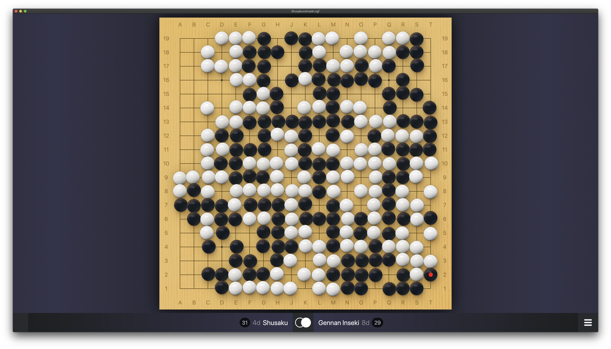
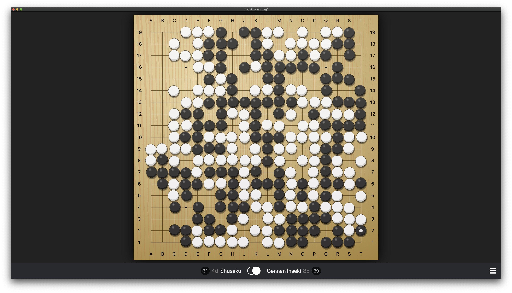
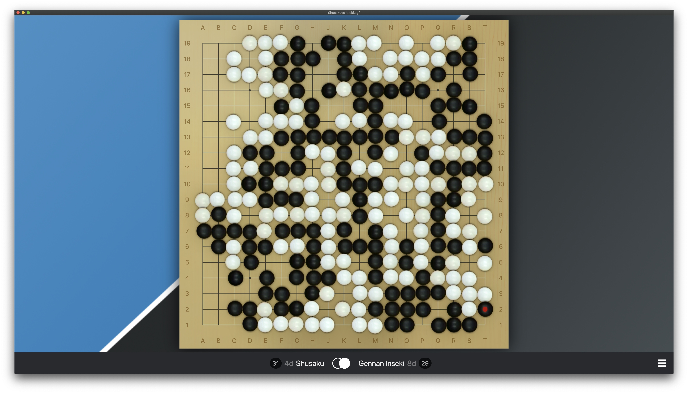

# Upsided's Sabaki Themes
These are various themes for the excellent [Sabaki](http://sabaki.yichuanshen.de/) go app.

## Happy Stones
Joyful board with glass stones that pop up when played. 

[Download](https://github.com/upsided/upsided-sabaki-themes/raw/master/packs/happy-stones.asar)

## Hikaru
A crisp SVG theme with an anime feel. 

[Download](https://github.com/upsided/upsided-sabaki-themes/raw/master/packs/hikaru.asar)

## BadukTV
Looks like a broadcast.

[Download](https://github.com/upsided/upsided-sabaki-themes/raw/master/packs/baduktv.asar)

## BadukTV (grunge)
Just like BadukTV, except the stones need washing. 

[Download](https://github.com/upsided/upsided-sabaki-themes/raw/master/packs/baduktv-grunge.asar)

## Kifu
Nice for old-school diagrams. Works best with fuzzy placement turned off. 

[Download](https://github.com/upsided/upsided-sabaki-themes/raw/master/packs/kifu.asar)

